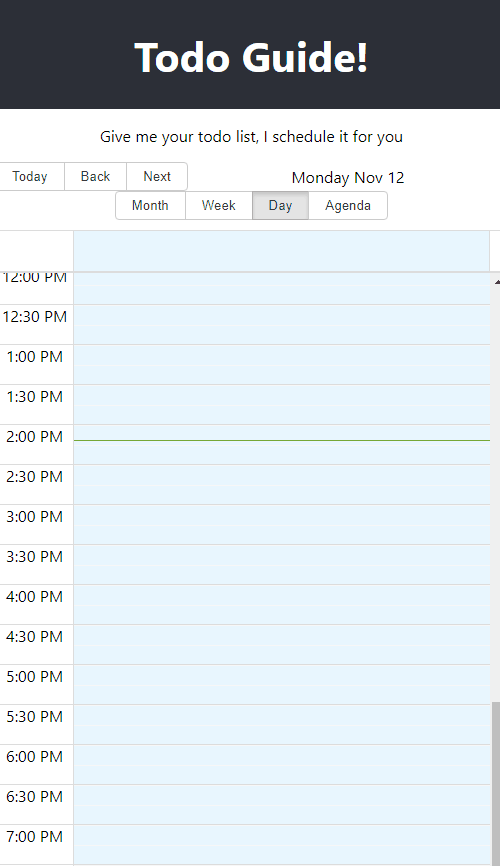

# Todo Guide

The todo list that guides you through your day!

Todo Guide helps manage expectations so you can focus on what's really important. Here's how it works:

* Add and prioritize your todo items
* Todo Guide shows those items in a calendar view so youknow realistically when they'll be done

When tasks take longer or shorter than expected, Todo Guide will shift your entire schedule accordingly!

 

## Developer Quick Start

After you've cloned the repo:

```bash
npm install
npm start
```

This runs the app in the development mode. Open [http://localhost:3000](http://localhost:3000) to view it in the browser.

The page will reload if you make edits and you will see any lint errors in the console.

### Run Tests

```bash
npm test
```

Launches the test runner in the interactive watch mode. See the React docs for [running tests](https://facebook.github.io/create-react-app/docs/running-tests) for more information.

### Build for Production

```bash
npm run build
```

Correctly bundles React in production mode and optimizes the build for the best performance in the `build/` folder. See the React docs for [deployment](https://facebook.github.io/create-react-app/docs/deployment).

## Resources

This project was bootstrapped with [Create React App](https://github.com/facebook/create-react-app). You can learn more in the [Create React App documentation](https://facebook.github.io/create-react-app/docs/getting-started). To learn React, check out the [React documentation](https://reactjs.org/).
